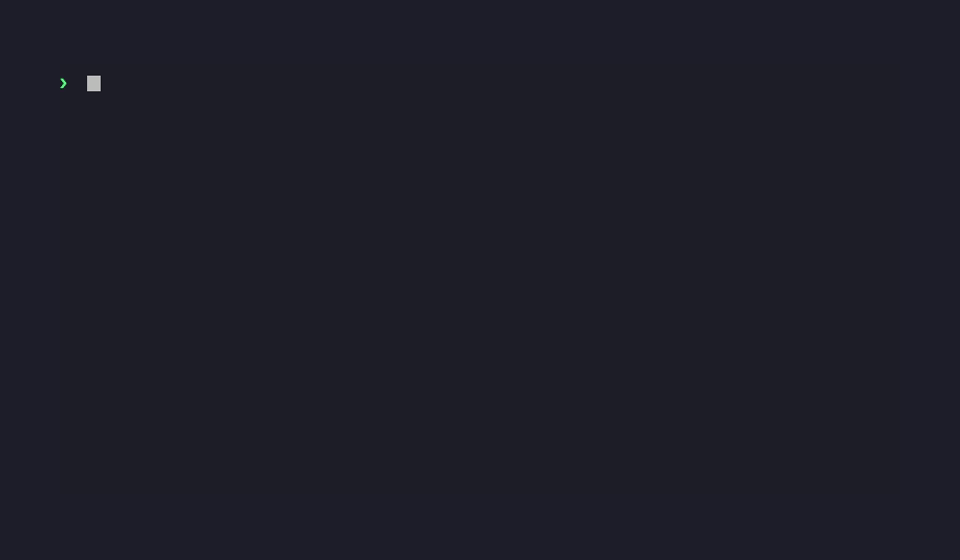

<div align="center">

# ZettaBrain RAG

**Chat with your documents using a fully local AI pipeline — no API keys, no cloud, no data leaving your machine.**

[](https://pypi.org/project/zettabrain-rag/)
[](https://pepy.tech/projects/zettabrain-rag)
[](https://pypi.org/project/zettabrain-rag/)
[](LICENSE)
[](#system-requirements)

<br>



</div>

<br>

ZettaBrain is a self-hosted RAG (Retrieval-Augmented Generation) assistant. Point it at a folder of documents and ask questions in plain language — through a web GUI or the terminal. It runs entirely on your own hardware using [Ollama](https://ollama.com) for inference and [ChromaDB](https://www.trychroma.com) for vector storage. Supports PDF, DOCX, TXT, and Markdown.

---

## Contents

- [Quick Install](#quick-install)
- [First-time Setup](#first-time-setup)
- [Commands](#commands)
- [Models](#models)
- [Retrieval Pipeline](#retrieval-pipeline)
- [System Requirements](#system-requirements)
- [Sample Test Data](#sample-test-data)
- [Configuration](#configuration)
- [Diagnostics](#diagnostics)
- [Uninstall](#uninstall)

---

## Quick Install

```bash
curl -fsSL https://zettabrain.app/install.sh | sudo bash
```

The installer detects your OS, installs Python 3.9+, [pipx](https://pipx.pypa.io), and [Ollama](https://ollama.com), then pulls the `nomic-embed-text` embedding model. Supported on Ubuntu, Debian, Amazon Linux, RHEL, Fedora, Rocky Linux, AlmaLinux, macOS, and Windows (WSL2).

**Developers — install via pipx:**

```bash
pipx install zettabrain-rag
```

---

## First-time Setup

**1. Run the setup wizard**

```bash
sudo zettabrain-setup
```

Configures your document storage (local disk, NFS, SMB, or S3), selects an LLM matched to your hardware, and enables HTTPS.

**2. Launch the web GUI**

```bash
zettabrain-server
```

The wizard prints the exact URL at the end of setup:

| TLS option | URL |
|---|---|
| Caddy (Let's Encrypt) | `https://your-domain.com:7860` |
| Self-signed | `https://<machine-ip>:7860` *(accept the one-time browser warning)* |
| HTTP only | `http://<machine-ip>:7860` |

**3. Or chat in the terminal**

```bash
zettabrain-chat
```

---

## Commands

| Command | Description |
|---|---|
| `sudo zettabrain-setup` | Storage wizard, model selection, TLS setup |
| `zettabrain-server` | Launch the HTTPS web GUI (port 7860) |
| `zettabrain-chat` | Interactive RAG chat in the terminal |
| `zettabrain-ingest` | Ingest documents into the vector store |
| `zettabrain-ingest --folder /path` | Ingest a specific folder |
| `zettabrain-ingest --file /path/doc.pdf` | Ingest a single file |
| `zettabrain-ingest --stats` | Show vector store contents |
| `zettabrain-ingest --clear` | Wipe the vector store |
| `zettabrain-status` | Show version, cert info, and store stats |
| `sudo zettabrain-storage add` | Add a storage source after initial setup |

**Inside `zettabrain-chat`:**

| Command | Action |
|---|---|
| *(any question)* | Query your documents |
| `sources` | Show which chunks were retrieved |
| `timing` | Show retrieve / generate times for this session |
| `debug on` / `debug off` | Toggle chunk-level debug output |
| `quit` | Exit |

---

## Models

`sudo zettabrain-setup` detects your hardware and recommends the best model. You can also select any Ollama model from the menu or enter a custom name.

**CPU-only**

| Model | Size | Speed | Best for |
|---|---|---|---|
| `qwen3:0.6b` | ~500 MB | Instant | Quick lookups, routing |
| `gemma3:1b` | ~815 MB | Very fast | Structured explanations |
| `tinyllama:1.1b` | ~638 MB | Very fast | Basic Q&A |
| `phi4-mini` ⭐ | ~2.5 GB | Moderate | **Best RAG reasoning on CPU** |
| `llama3.2:3b` | ~2 GB | Moderate | General purpose |
| `mistral:7b` | ~4 GB | Slow | Strong instruction (needs 12 GB+ RAM) |
| `llama3.1:8b` | ~5 GB | Slow | Balanced quality (needs 16 GB+ RAM) |

**GPU**

| Model | VRAM | Speed | Best for |
|---|---|---|---|
| `phi4-mini` | ~2.5 GB | Fast | Best reasoning per GB |
| `mistral:7b` | ~4 GB | Fast | Strong instruction following |
| `openhermes` | ~4 GB | Fast | Formatted RAG responses |
| `llama3.1:8b` | ~5 GB | Fast | Balanced quality |
| `mistral-nemo:12b` | ~7 GB | Moderate | Better reasoning |
| `qwen2.5:14b` | ~9 GB | Moderate | Excellent quality |
| `qwen2.5:32b` | ~20 GB | Slower | Best quality |

Switch model at any time by editing `/opt/zettabrain/src/zettabrain.env`:

```bash
ZETTABRAIN_LLM_MODEL=qwen2.5:14b
```

Then restart: `zettabrain-server`

**Performance reference** — compliance query against a 10-document financial corpus:

| Model | RAM | Retrieve | Generate | Total |
|---|---|---|---|---|
| `qwen3:0.6b` (CPU) | 2 GB | ~1 s | 15–40 s | ~1 min |
| `phi4-mini` (CPU) | 6 GB | ~1 s | 120–300 s | 2–5 min |
| `llama3.2:3b` (CPU) | 6 GB | ~1 s | 90–180 s | 2–3 min |
| `llama3.1:8b` (CPU) | 16 GB | ~1 s | 200–400 s | 4–7 min |
| `mistral:7b` (GPU) | 8 GB | ~1 s | 5–12 s | 6–13 s |
| `llama3.1:8b` (GPU) | 10 GB | ~1 s | 3–7 s | 4–8 s |
| `qwen2.5:14b` (GPU) | 20 GB | ~1 s | 4–10 s | 5–11 s |
| Apple M2/M3 16 GB | 16 GB | ~1 s | 10–20 s | 11–21 s |

---

## Retrieval Pipeline

ZettaBrain uses a five-stage hybrid retrieval pipeline:

1. **Adaptive chunking** — chunk size tuned per document type and text density
2. **MMR semantic search** — Maximum Marginal Relevance via ChromaDB (diversity + relevance)
3. **BM25 keyword search** — exact-term matching on the same corpus
4. **Merge & deduplicate** — semantic results ranked first, duplicates removed by content hash
5. **Cross-encoder re-ranking** — FlashRank (`ms-marco-MiniLM-L-12-v2`) selects the best chunks

Supported formats: `.pdf` · `.docx` · `.txt` · `.md`

---

## System Requirements

| | Minimum | Recommended |
|---|---|---|
| **RAM** | 4 GB | 8 GB (CPU) · 16 GB+ (GPU) |
| **CPU** | 4 cores / 2.5 GHz | 8 cores / 3.0 GHz |
| **Disk** | 10 GB free | 40 GB free |
| **Python** | 3.9 | 3.11+ |

**Supported platforms**

| Platform | Versions |
|---|---|
| Ubuntu | 20.04, 22.04, 24.04 |
| Debian | 11, 12 |
| Amazon Linux | 2, 2023 |
| RHEL / CentOS Stream / Rocky / AlmaLinux | 8, 9 |
| Fedora | 38+ |
| Linux Mint / Pop!\_OS | Current releases |
| macOS | 12 Monterey+ *(via `pipx install`)* |
| Windows | 10 / 11 via WSL2 |

GPU is optional. Ollama auto-detects NVIDIA (CUDA), AMD (ROCm), and Apple Silicon (Metal).

---

## Sample Test Data

Not ready to use your own documents? Download realistic enterprise datasets to evaluate ZettaBrain immediately.

| Dataset | Documents | Organisation |
|---|---|---|
| [Financial Services](https://zettabrain.io/sample-data/zettabrain-financial-test-docs.zip) | 10 DOCX · ~90 KB | Apex Financial Group — trading policy, AML/KYC, insider trading, risk framework |
| [Healthcare](https://zettabrain.io/sample-data/zettabrain-healthcare-test-docs.zip) | 10 DOCX · ~91 KB | Riverside Medical Center — HIPAA, medication protocols, emergency codes |
| [Test prompts guide](https://zettabrain.io/sample-data/RAG_Test_Prompts_Guide.md) | 40 prompts · ~7 KB | 20 per dataset + cross-document + adversarial |

```bash
curl -LO https://zettabrain.io/sample-data/zettabrain-financial-test-docs.zip
unzip zettabrain-financial-test-docs.zip -d ~/zettabrain-test
zettabrain-ingest --folder ~/zettabrain-test/financial
zettabrain-chat
```

**Sample prompts (financial)**

- *"What is the pre-clearance process for personal securities trades and how long does approval last?"*
- *"When do I need to file a Suspicious Activity Report and what is the deadline?"*
- *"What is the maximum hotel rate I can expense in New York City?"*

**Sample prompts (healthcare)**

- *"What should I do if I suspect a PHI breach — who do I contact and what is the timeline?"*
- *"Which medications require an independent double-check before administration?"*
- *"What are the emergency response codes and what action should staff take for each?"*

---

## Configuration

All settings can be set via environment variables or `/opt/zettabrain/src/zettabrain.env`:

| Variable | Default | Description |
|---|---|---|
| `ZETTABRAIN_DOCS` | `/opt/zettabrain/data` | Documents folder |
| `ZETTABRAIN_CHROMA` | `/opt/zettabrain/src/zettabrain_vectorstore` | ChromaDB path |
| `ZETTABRAIN_LLM_MODEL` | `phi4-mini` | Ollama LLM model |
| `ZETTABRAIN_EMBED_MODEL` | `nomic-embed-text` | Ollama embedding model |
| `ZETTABRAIN_CHUNK_SIZE` | `1000` (PDF) / `800` (TXT) | Chunk size |
| `ZETTABRAIN_CHUNK_OVERLAP` | `150` (PDF) / `100` (TXT) | Chunk overlap |
| `OLLAMA_HOST` | `http://localhost:11434` | Ollama API endpoint |

---

## Diagnostics

```bash
zettabrain-status                              # version, certs, store stats
curl http://localhost:11434                    # check Ollama is running
ollama list                                    # list downloaded models
journalctl -u zettabrain -f                   # stream server logs (Linux)
tail -f /opt/zettabrain/logs/server.log       # stream server logs (macOS)
```

---

## Uninstall

```bash
pipx uninstall zettabrain-rag
sudo rm -rf /opt/zettabrain
sudo systemctl disable --now zettabrain 2>/dev/null || true
```

---

## License

MIT © [ZettaBrain](https://zettabrain.io)
