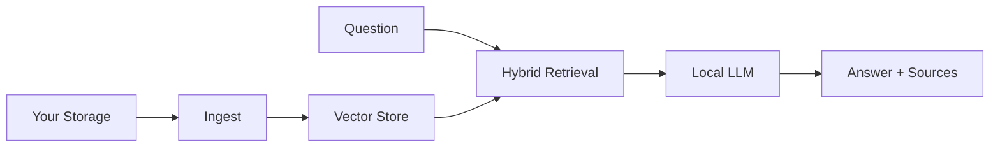

<p align="center">
  
</p>

<h1 align="center">ZettaBrain RAG</h1>

<h3 align="center">Chat with your documents. Generate documents from them.</h3>

<p align="center">
ZettaBrain plugs into NFS, SMB, S3, or OneDrive, answers questions with citations, and runs 21 Skills that turn your corpus into SOPs, quotes, compliance reports, and more. Local AI, no cloud.
</p>

<p align="center">
  <a href="https://pypi.org/project/zettabrain-rag/"></a>
  <a href="https://pepy.tech/projects/zettabrain-rag"></a>
  <a href="https://pypi.org/project/zettabrain-rag/"></a>
  <a href="LICENSE"></a>
  <a href="#supported-platforms"></a>
</p>

<p align="center">
  <a href="#your-first-answer-in-60-seconds"><strong>Install</strong></a> · 
  <a href="#try-with-sample-data"><strong>Try with sample data</strong></a> · 
  <a href="https://github.com/zettabrain/zettabrain-rag"><strong>Star the repo</strong></a>
</p>

---

## Your first answer in 60 seconds

```bash
curl -fsSL https://zettabrain.app/install.sh | sudo bash
```

The installer sets up Python, Ollama, and the embedding model. Run the setup wizard, then launch:

```bash
sudo zettabrain-setup      # Configure storage and model
zettabrain-server          # Start web GUI at https://localhost:7860
```

Or install via pip:

```bash
pip install zettabrain-rag
```

### Try with sample data

Not ready to point it at your own files? Download a test corpus and start asking questions immediately:

```bash
curl -LO https://zettabrain.io/sample-data/zettabrain-financial-test-docs.zip
unzip zettabrain-financial-test-docs.zip -d ~/zettabrain-test
zettabrain-ingest --folder ~/zettabrain-test/financial
zettabrain-chat
```

Ask: *"What is the pre-clearance process for personal securities trades?"*

You'll get an answer with citations like `[Trading_Policy.docx p.3]`.

---

## The problem

**Before:** Someone asks about the expense policy. You open the shared drive, guess which folder it's in, skim three PDFs, Ctrl+F through a 40-page handbook, and hope you found the right version.

**After:** You ask ZettaBrain. It searches every document you've indexed, pulls the relevant paragraphs, and gives you a sourced answer in seconds.

And when you need to write a compliance report, SOP, or RFP response? Skills pull facts from your corpus and generate a draft grounded in your actual documents, not hallucinated boilerplate.

---

## What you get

| | |
|---|---|
| **Connects to your storage** | Local disk, NFS, SMB/CIFS, S3, OneDrive. No uploads, no file migration. |
| **Chat with citations** | Ask questions in plain language. Every answer cites the source document and page. |
| **21 built-in Skills** | Generate executive summaries, compliance audits, RFP responses, SOPs, runbooks, and more. |
| **Fully local by default** | Runs on Ollama. Your documents and queries never leave your machine. |
| **Cloud LLMs optional** | Connect Claude, Gemini, or OpenAI when you need more power. |
| **25 free trial requests** | Try instantly with zero setup. No API key, no model download. |

---

## How it works


```mermaid
flowchart LR
    A[Your Storage] --> B[Ingest]
    B --> C[Vector Store]
    D[Question] --> E[Hybrid Retrieval]
    C --> E
    E --> F[Local LLM]
    F --> G[Answer + Sources]
```

**Storage:** ZettaBrain reads from wherever your documents already live: a local folder, NFS share, SMB server, S3 bucket, or OneDrive.

**Ingest:** Documents are chunked (size tuned per file type and storage latency), embedded, and stored in ChromaDB. MD5 hashes track what's been indexed, so re-runs only process new or changed files.

**Retrieval:** A five-stage hybrid pipeline finds the best context for your question:

1. **MMR semantic search** finds chunks with similar meaning while maintaining diversity
2. **BM25 keyword search** catches exact terms the embedding might miss
3. **Merge and deduplicate** combines both result sets
4. **Cross-encoder re-ranking** (FlashRank) scores each chunk against your question
5. **Top chunks** go to the LLM with your question

**Generation:** The LLM sees only your question and the retrieved context. It answers based on that context and cites sources. For Skills, the same retrieval feeds a structured prompt that produces a formatted document.

---

## Built for

<table>
<tr>
<td width="50%">

### Finance and compliance

*"When do I need to file a Suspicious Activity Report and what is the deadline?"*

Index your AML policy, trading guidelines, and expense handbook. Get sourced answers for audits. Generate compliance checklists grounded in your actual procedures.

</td>
<td width="50%">

### Healthcare

*"Which medications require an independent double-check before administration?"*

HIPAA policies, medication protocols, emergency codes. Staff can ask questions without digging through binders. Nothing leaves your network.

</td>
</tr>
<tr>
<td width="50%">

### Legal and procurement

*"What are the termination provisions in the Acme vendor contract?"*

Index contracts, NDAs, and procurement policies. Summarize key terms with the Contract Summary skill. Flag unusual clauses automatically.

</td>
<td width="50%">

### IT and consulting

*"How do we handle an S3 bucket permission escalation?"*

Runbooks, architecture docs, past incident reports. Generate new runbooks from existing documentation. Keep tribal knowledge searchable.

</td>
</tr>
</table>

---

## Your data stays yours

ZettaBrain is private by default:

- **Local inference:** Ollama runs on your machine. Queries and documents never hit an external API unless you configure one.
- **Local vector store:** Embeddings are stored in ChromaDB on disk, not in any cloud service.
- **No telemetry:** No analytics, no usage tracking, no phoning home.
- **Your storage:** Documents stay where they are. ZettaBrain reads from your NFS/SMB/S3 mount; it doesn't copy files to a separate location.

When you enable a cloud LLM (Claude, Gemini, OpenAI), your queries and retrieved chunks are sent to that provider. The setup wizard and web UI make this choice explicit.

---

## Skills

Skills are document generators. They combine a structured prompt with context retrieved from your corpus to produce formatted output: an executive summary, a compliance audit, an RFP response.

### Built-in Skills

| Category | Skills |
|----------|--------|
| Business | Executive Summary, Project Proposal, Status Report, RFP Response, Contract Summary |
| Technical | API Documentation, Architecture Decision Record, Technical Doc, Data Dictionary |
| Operations | SOP Generator, Runbook, Incident Report, Change Request, Release Notes |
| Compliance | Compliance Audit, Security Assessment |
| HR and training | Onboarding Guide, Training Material, Knowledge Base Article |
| Communication | Email Drafter, Meeting Notes |

### Price lists

Upload an Excel price list and Skills can generate quotes with real prices. Figures are tool-calculated from your data, never hallucinated by the model.

### Create your own

Add a markdown file to `/opt/zettabrain/src/skills/`:

```markdown
---
name: My Custom Skill
version: 1.0.0
description: What this skill generates
requires_corpus: true
temperature: 0.5
max_tokens: 2000
---

Your prompt instructions here. Reference {context} for retrieved documents
and {user_input} for what the user provides.
```

Or use the AI-assisted skill drafter in the web UI: describe what you want, and ZettaBrain generates a skill definition from your corpus.

---

## Pick your model

**Laptop (no GPU)?** Start with `phi4-mini`. Best reasoning-per-GB on CPU.

**Have a GPU?** `qwen2.5:14b` for quality, `mistral:7b` for speed.

**Apple Silicon?** Metal acceleration is automatic. `phi4-mini` or `llama3.1:8b` work well.

**Just trying it out?** Use the trial mode (25 free requests, no setup).

<details>
<summary><strong>Full model tables</strong></summary>

### CPU-only

| Model | Size | Speed | Best for |
|-------|------|-------|----------|
| `qwen3:0.6b` | ~500 MB | Instant | Quick lookups |
| `gemma3:1b` | ~815 MB | Very fast | Structured explanations |
| `phi4-mini` | ~2.5 GB | Moderate | Best RAG reasoning on CPU |
| `llama3.2:3b` | ~2 GB | Moderate | General purpose |
| `mistral:7b` | ~4 GB | Slow | Strong instruction (12 GB+ RAM) |
| `llama3.1:8b` | ~5 GB | Slow | Balanced quality (16 GB+ RAM) |

### GPU

| Model | VRAM | Speed | Best for |
|-------|------|-------|----------|
| `phi4-mini` | ~2.5 GB | Fast | Best reasoning per GB |
| `mistral:7b` | ~4 GB | Fast | Strong instruction following |
| `llama3.1:8b` | ~5 GB | Fast | Balanced quality |
| `mistral-nemo:12b` | ~7 GB | Moderate | Better reasoning |
| `qwen2.5:14b` | ~9 GB | Moderate | Excellent quality |
| `qwen2.5:32b` | ~20 GB | Slower | Best quality |

</details>

---

## Performance

ZettaBrain runs on CPU, flies on GPU.

Retrieval is fast everywhere (~1 second). Generation speed depends on your hardware:

| Setup | Generate time | Total |
|-------|---------------|-------|
| `phi4-mini` on CPU | 2-5 min | Usable for async workflows |
| `mistral:7b` on GPU | 5-12 s | Interactive |
| `qwen2.5:14b` on GPU | 4-10 s | Interactive, higher quality |
| Apple M2/M3 16 GB | 10-20 s | Interactive |

For CPU-only machines, the trial mode or a cloud LLM gives instant responses while you evaluate.

---

## Supported platforms

| Platform | Versions |
|----------|----------|
| Ubuntu | 20.04, 22.04, 24.04 |
| Debian | 11, 12 |
| Amazon Linux | 2, 2023 |
| RHEL / Rocky / AlmaLinux | 8, 9 |
| Fedora | 38+ |
| macOS | 12+ (Intel and Apple Silicon) |
| Windows | 10/11 via WSL2 |

---

## Reference

Full documentation for commands, configuration, diagnostics, storage backends, API endpoints, and uninstallation:

**[docs/REFERENCE.md](docs/REFERENCE.md)**

---

## Roadmap

- [ ] Scheduled ingestion (auto-sync on interval)
- [ ] Multi-user authentication
- [ ] More built-in Skills
- [ ] Slack and Teams integration
- [ ] API rate limiting and usage tracking

Have a feature request? [Open an issue](https://github.com/zettabrain/zettabrain-rag/issues).

---

## Contributing

Contributions welcome. Please open an issue to discuss before submitting large changes.

```bash
git clone https://github.com/zettabrain/zettabrain-rag.git
cd zettabrain-rag
pip install -e ".[dev]"
pytest
```

---

## License

MIT. See [LICENSE](LICENSE).

---

<p align="center">
  <strong>Built by <a href="https://zettabrain.io">ZettaBrain</a></strong><br>
  If this helps you, <a href="https://github.com/zettabrain/zettabrain-rag">star the repo</a>.
</p>
