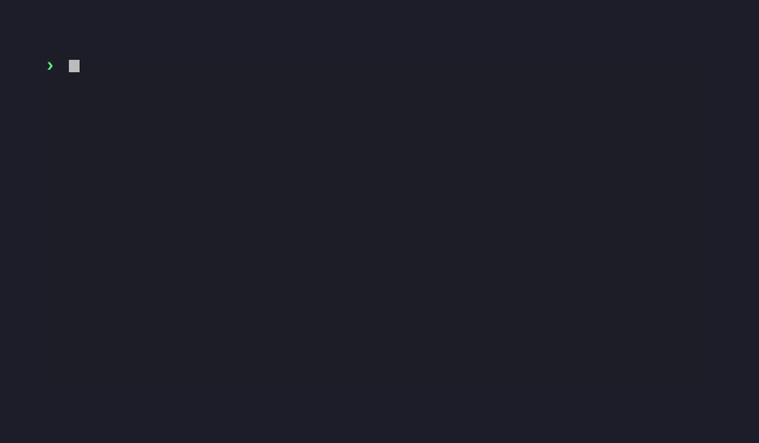

<div align="center">

# ZettaBrain RAG

**Private AI document assistant — chat with your documents AND generate accurate business documents from them. Zero cloud required.**

[](https://pypi.org/project/zettabrain-rag/)
[](https://pepy.tech/projects/zettabrain-rag)
[](https://pypi.org/project/zettabrain-rag/)
[](LICENSE)
[](#system-requirements)

<br>



</div>

<br>

ZettaBrain is a self-hosted RAG (Retrieval-Augmented Generation) assistant with a built-in **Skills** platform. Point it at your documents and:

- **Chat** — ask questions in plain language and get grounded answers
- **Generate** — create accurate business documents (quotes, SOPs, compliance reports, RFP responses, and more) using your own data

Runs entirely on your hardware using local models, or connect to Claude, Gemini, or OpenAI-compatible APIs. Supports PDF, DOCX, TXT, Markdown, and Excel.

---

## What's New in v1.0.0

- **21 built-in Skills** — generate executive summaries, RFP responses, compliance audits, SOPs, runbooks, and more
- **Multi-LLM support** — Ollama (local), Claude, Gemini, or any OpenAI-compatible API
- **OneDrive integration** — connect your Microsoft 365 documents
- **Trial mode** — try ZettaBrain instantly with 25 free requests (no API key needed)
- **Price list generation** — create quotes and pricing documents from your product data

---

## Contents

- [Quick Install](#quick-install)
- [First-time Setup](#first-time-setup)
- [Skills Platform](#skills-platform)
- [Commands](#commands)
- [LLM Providers](#llm-providers)
- [Models](#models)
- [Retrieval Pipeline](#retrieval-pipeline)
- [System Requirements](#system-requirements)
- [Sample Test Data](#sample-test-data)
- [Configuration](#configuration)
- [Diagnostics](#diagnostics)
- [Uninstall](#uninstall)

---

## Quick Install

```bash
curl -fsSL https://zettabrain.app/install.sh | sudo bash
```

The installer detects your OS, installs Python 3.10+, [pipx](https://pipx.pypa.io), and [Ollama](https://ollama.com), then pulls the `nomic-embed-text` embedding model. Supported on Ubuntu, Debian, Amazon Linux, RHEL, Fedora, Rocky Linux, AlmaLinux, macOS, and Windows (WSL2).

**Install via pip:**

```bash
pip install zettabrain-rag
```

**Install with cloud provider support:**

```bash
pip install zettabrain-rag[all]      # Claude + OpenAI + PDF export
pip install zettabrain-rag[claude]   # Claude only
pip install zettabrain-rag[openai]   # OpenAI only
```

---

## First-time Setup

**1. Run the setup wizard**

```bash
sudo zettabrain-setup
```

Configures your document storage (local disk, NFS, SMB, S3, or OneDrive), selects an LLM, and enables HTTPS.

**2. Launch the web GUI**

```bash
zettabrain-server
```

The wizard prints the exact URL at the end of setup:

| TLS option | URL |
|---|---|
| Caddy (Let's Encrypt) | `https://your-domain.com:7860` |
| Self-signed | `https://<machine-ip>:7860` *(accept the one-time browser warning)* |
| HTTP only | `http://<machine-ip>:7860` |

**3. Or chat in the terminal**

```bash
zettabrain-chat
```

**Try it instantly (no setup):**

ZettaBrain includes a trial mode with 25 free requests — just launch the server and start chatting. No API keys, no model downloads required.

---

## Skills Platform

Skills are document generators that combine your instructions with your corpus data to produce accurate, grounded business documents.

### Built-in Skills

| Category | Skills |
|---|---|
| **Business** | Executive Summary, Project Proposal, Status Report, RFP Response, Contract Summary |
| **Technical** | API Documentation, Architecture Decision Record, Technical Doc, Data Dictionary |
| **Operations** | SOP Generator, Runbook, Incident Report, Change Request, Release Notes |
| **Compliance** | Compliance Audit, Security Assessment |
| **HR & Training** | Onboarding Guide, Training Material, Knowledge Base Article |
| **Communication** | Email Drafter, Meeting Notes |

### Using Skills

1. **Web UI** — Select a skill from the dropdown, provide context, and generate
2. **API** — POST to `/api/generate` with skill name and parameters

### Custom Skills

Create your own skills by adding a Markdown file to the skills directory:

```markdown
---
name: My Custom Skill
version: 1.0.0
description: Generate custom documents
requires_corpus: true
temperature: 0.5
max_tokens: 2000
---

Your prompt instructions here...
```

---

## Commands

| Command | Description |
|---|---|
| `sudo zettabrain-setup` | Storage wizard, model selection, TLS setup |
| `zettabrain-server` | Launch the HTTPS web GUI (port 7860) |
| `zettabrain-lite` | Alias for `zettabrain-server` |
| `zettabrain-chat` | Interactive RAG chat in the terminal |
| `zettabrain-ingest` | Ingest documents into the vector store |
| `zettabrain-ingest --folder /path` | Ingest a specific folder |
| `zettabrain-ingest --file /path/doc.pdf` | Ingest a single file |
| `zettabrain-ingest --stats` | Show vector store contents |
| `zettabrain-ingest --clear` | Wipe the vector store |
| `zettabrain-status` | Show version, cert info, and store stats |
| `sudo zettabrain-storage add` | Add a storage source after initial setup |

**Inside `zettabrain-chat`:**

| Command | Action |
|---|---|
| *(any question)* | Query your documents |
| `sources` | Show which chunks were retrieved |
| `timing` | Show retrieve / generate times for this session |
| `debug on` / `debug off` | Toggle chunk-level debug output |
| `quit` | Exit |

---

## LLM Providers

ZettaBrain supports multiple LLM backends:

| Provider | Setup | Best For |
|---|---|---|
| **Trial** (default) | None — works out of the box | Quick evaluation, demos |
| **Ollama** | Install [Ollama](https://ollama.com) and pull a model | Privacy, offline use, no API costs |
| **Claude** | Set `ANTHROPIC_API_KEY` | Best reasoning, complex documents |
| **Gemini** | Set `GOOGLE_API_KEY` | Fast, cost-effective |
| **OpenAI-compatible** | Set `OPENAI_API_KEY` and `OPENAI_BASE_URL` | Custom deployments, Azure |

Configure in `/opt/zettabrain/src/zettabrain.env` or via environment variables:

```bash
ZETTABRAIN_LLM_PROVIDER=claude
ANTHROPIC_API_KEY=sk-ant-...
```

---

## Models

`sudo zettabrain-setup` detects your hardware and recommends the best model. You can also select any Ollama model from the menu or enter a custom name.

**CPU-only**

| Model | Size | Speed | Best for |
|---|---|---|---|
| `qwen3:0.6b` | ~500 MB | Instant | Quick lookups, routing |
| `gemma3:1b` | ~815 MB | Very fast | Structured explanations |
| `tinyllama:1.1b` | ~638 MB | Very fast | Basic Q&A |
| `phi4-mini` | ~2.5 GB | Moderate | **Best RAG reasoning on CPU** |
| `llama3.2:3b` | ~2 GB | Moderate | General purpose |
| `mistral:7b` | ~4 GB | Slow | Strong instruction (needs 12 GB+ RAM) |
| `llama3.1:8b` | ~5 GB | Slow | Balanced quality (needs 16 GB+ RAM) |

**GPU**

| Model | VRAM | Speed | Best for |
|---|---|---|---|
| `phi4-mini` | ~2.5 GB | Fast | Best reasoning per GB |
| `mistral:7b` | ~4 GB | Fast | Strong instruction following |
| `openhermes` | ~4 GB | Fast | Formatted RAG responses |
| `llama3.1:8b` | ~5 GB | Fast | Balanced quality |
| `mistral-nemo:12b` | ~7 GB | Moderate | Better reasoning |
| `qwen2.5:14b` | ~9 GB | Moderate | Excellent quality |
| `qwen2.5:32b` | ~20 GB | Slower | Best quality |

Switch model at any time by editing `/opt/zettabrain/src/zettabrain.env`:

```bash
ZETTABRAIN_LLM_MODEL=qwen2.5:14b
```

Then restart: `zettabrain-server`

---

## Retrieval Pipeline

ZettaBrain uses a five-stage hybrid retrieval pipeline:

1. **Adaptive chunking** — chunk size tuned per document type and text density
2. **MMR semantic search** — Maximum Marginal Relevance via ChromaDB (diversity + relevance)
3. **BM25 keyword search** — exact-term matching on the same corpus
4. **Merge & deduplicate** — semantic results ranked first, duplicates removed by content hash
5. **Cross-encoder re-ranking** — FlashRank (`ms-marco-MiniLM-L-12-v2`) selects the best chunks

Supported formats: `.pdf` · `.docx` · `.txt` · `.md` · `.xlsx`

---

## System Requirements

| | Minimum | Recommended |
|---|---|---|
| **RAM** | 4 GB | 8 GB (CPU) · 16 GB+ (GPU) |
| **CPU** | 4 cores / 2.5 GHz | 8 cores / 3.0 GHz |
| **Disk** | 10 GB free | 40 GB free |
| **Python** | 3.10 | 3.11+ |

**Supported platforms**

| Platform | Versions |
|---|---|
| Ubuntu | 20.04, 22.04, 24.04 |
| Debian | 11, 12 |
| Amazon Linux | 2, 2023 |
| RHEL / CentOS Stream / Rocky / AlmaLinux | 8, 9 |
| Fedora | 38+ |
| Linux Mint / Pop!\_OS | Current releases |
| macOS | 12 Monterey+ |
| Windows | 10 / 11 via WSL2 |

GPU is optional. Ollama auto-detects NVIDIA (CUDA), AMD (ROCm), and Apple Silicon (Metal).

---

## Sample Test Data

Not ready to use your own documents? Download realistic enterprise datasets to evaluate ZettaBrain immediately.

| Dataset | Documents | Organisation |
|---|---|---|
| [Financial Services](https://zettabrain.io/sample-data/zettabrain-financial-test-docs.zip) | 10 DOCX · ~90 KB | Apex Financial Group — trading policy, AML/KYC, insider trading, risk framework |
| [Healthcare](https://zettabrain.io/sample-data/zettabrain-healthcare-test-docs.zip) | 10 DOCX · ~91 KB | Riverside Medical Center — HIPAA, medication protocols, emergency codes |
| [Test prompts guide](https://zettabrain.io/sample-data/RAG_Test_Prompts_Guide.md) | 40 prompts · ~7 KB | 20 per dataset + cross-document + adversarial |

```bash
curl -LO https://zettabrain.io/sample-data/zettabrain-financial-test-docs.zip
unzip zettabrain-financial-test-docs.zip -d ~/zettabrain-test
zettabrain-ingest --folder ~/zettabrain-test/financial
zettabrain-chat
```

**Sample prompts (financial)**

- *"What is the pre-clearance process for personal securities trades and how long does approval last?"*
- *"When do I need to file a Suspicious Activity Report and what is the deadline?"*
- *"What is the maximum hotel rate I can expense in New York City?"*

**Sample prompts (healthcare)**

- *"What should I do if I suspect a PHI breach — who do I contact and what is the timeline?"*
- *"Which medications require an independent double-check before administration?"*
- *"What are the emergency response codes and what action should staff take for each?"*

---

## Configuration

All settings can be set via environment variables or `/opt/zettabrain/src/zettabrain.env`:

| Variable | Default | Description |
|---|---|---|
| `ZETTABRAIN_DOCS` | `/opt/zettabrain/data` | Documents folder |
| `ZETTABRAIN_CHROMA` | `/opt/zettabrain/src/zettabrain_vectorstore` | ChromaDB path |
| `ZETTABRAIN_LLM_PROVIDER` | `trial` | LLM provider (trial, ollama, claude, gemini, openai) |
| `ZETTABRAIN_LLM_MODEL` | `phi4-mini` | Ollama LLM model |
| `ZETTABRAIN_EMBED_MODEL` | `nomic-embed-text` | Ollama embedding model |
| `ZETTABRAIN_CHUNK_SIZE` | `1000` (PDF) / `800` (TXT) | Chunk size |
| `ZETTABRAIN_CHUNK_OVERLAP` | `150` (PDF) / `100` (TXT) | Chunk overlap |
| `OLLAMA_HOST` | `http://localhost:11434` | Ollama API endpoint |
| `ANTHROPIC_API_KEY` | — | Claude API key |
| `GOOGLE_API_KEY` | — | Gemini API key |
| `OPENAI_API_KEY` | — | OpenAI API key |
| `OPENAI_BASE_URL` | — | Custom OpenAI-compatible endpoint |

---

## Diagnostics

```bash
zettabrain-status                              # version, certs, store stats
curl http://localhost:11434                    # check Ollama is running
ollama list                                    # list downloaded models
journalctl -u zettabrain -f                   # stream server logs (Linux)
tail -f /opt/zettabrain/logs/server.log       # stream server logs (macOS)
```

---

## Uninstall

```bash
pip uninstall zettabrain-rag
sudo rm -rf /opt/zettabrain
sudo systemctl disable --now zettabrain 2>/dev/null || true
```

---

## License

MIT © [ZettaBrain](https://zettabrain.io)
